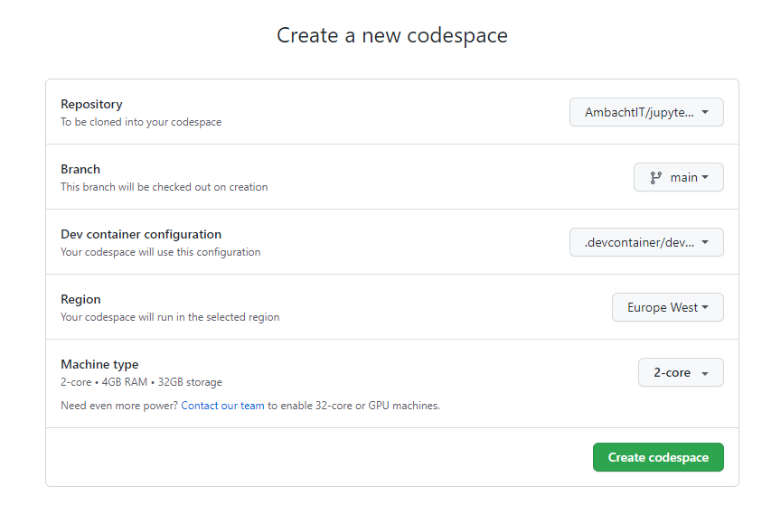

# jupyter-csharp
This repository contains a GitHub codespaces environment with C# and polyglot support for Jupyter Notebooks. I have added some documentation to clarify which might save you a bit of googling.

## Usage
1. Clone this repository
2. Create a new code space based on the repository.

3. Wait for initialization to finish (this might take a while).
4. Open `notebooks/csharp.ipynb`. This will prompt some additional loading activity.
5. Behold!

## How it works
This sample is based on the [Jupyter Github Codespaces sample](https://github.com/github/codespaces-jupyter).

I had to make some modifications to get C# to work:

1. Although .NET 7 is already installed in the base container, the tooling did not work out of the box with this version. Explicitly installing .NET using `dotnet-install.sh` did the trick.
2. The original sample only runs a single command in the `updateContentCommand` hook in `./devcontainer/devcontainer.json`. Since I needed to run a few commands, I moved those into a separate script called `update-content.sh`.
3. Both scripts need execute privileges. These are set up correctly in this repository. If you download the code instead of cloning the repository you may need to set them yourselves.

## Modification
If you want to understand how this works, start by looking at `./devcontainer/devcontainer.json`. This file contains most of the 'magic' that ties everything together. I learned a lot by inspecting this file and trying to change its behaviour.

## Data used
The sample uses a [FIFA world cup match result data set hosted on Kaggle](https://www.kaggle.com/datasets/piterfm/fifa-football-world-cup).

## Documentation used:
* https://github.com/github/codespaces-jupyter
* https://docs.servicestack.net/jupyter-notebooks-csharp#example-generated-notebook
* https://containers.dev/implementors/json_reference/